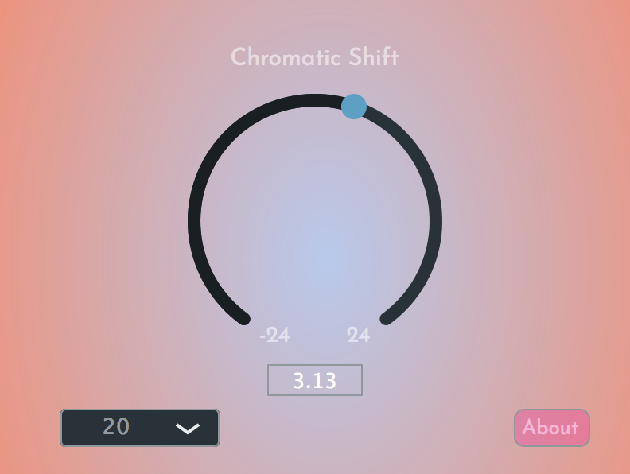

# Chromatic-Shifter

Chromatic Shift is an audio plugin (AU and VST3) that uses three interpolating delays to pitch shift audio.
The range of the plugin is two octaves below and two octaves above the original audio.
A window delay (5ms to 50ms set outside playback) changes audio quality at more extreme settings. Default is 20ms.

Here is a screenshot of the plugin

Enjoy!